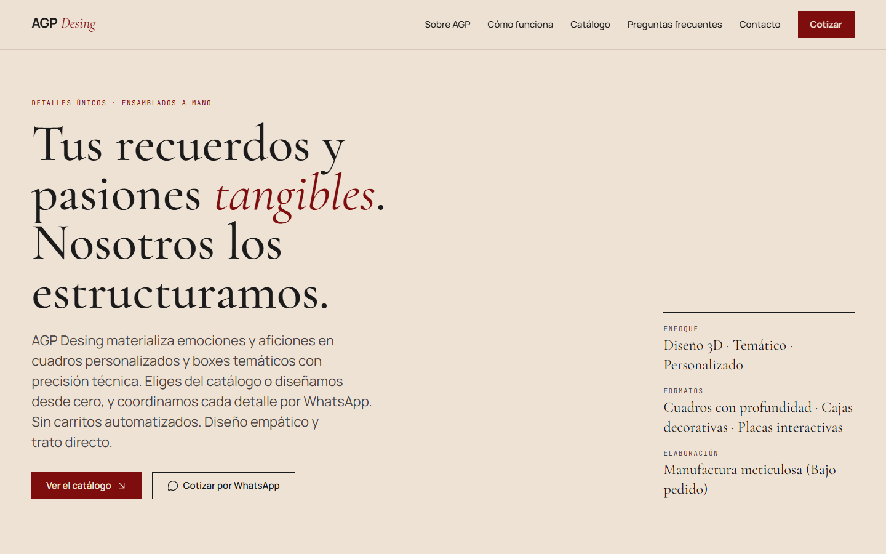

# AGP Desing

Catálogo web de un taller peruano de regalos personalizados: cuadros 3D y boxes temáticos hechos
por encargo. La web enseña el trabajo y abre la conversación por WhatsApp; el dueño publica y
edita las piezas desde un panel propio, sin tocar código.

Trujillo, La Libertad · Perú



---

## Qué hace

**Para quien visita**

- Una portada editorial, con el titular como pieza principal y una imagen opcional al lado.
- El catálogo, montado como una pared de galería: alturas escalonadas y la ficha debajo de cada
  pieza, como en una exposición. Cada foto se ve entera, con su propia proporción.
- La ficha de cada pieza, con medidas, formato, precio de referencia y un botón que abre WhatsApp
  con el mensaje ya escrito.
- Páginas de privacidad y de términos, redactadas para la normativa peruana (Ley 29733 y el
  Código de Protección y Defensa del Consumidor).

**Para quien lo administra**

- Entrar con usuario y contraseña, y desde ahí crear, editar y retirar piezas del catálogo.
- **Subir las fotos desde el ordenador**, sin pasar por ningún sitio de terceros: se elige el
  archivo, se ve al momento y queda publicado.
- Cambiar la imagen de la portada, o dejarla sin imagen y que quede solo el titular.

## Cómo está hecho

| | |
|---|---|
| **Web** | React 19 · TypeScript · Vite 8 · Tailwind v4 · React Router 7 · Motion |
| **API** | Java 21 · Spring Boot 3.5 · Clean Architecture · Flyway · JWT |
| **Datos** | Supabase — PostgreSQL para el catálogo, Storage para las fotos |
| **Despliegue** | Vercel (web) y Render (API), con Docker |

El backend está partido en capas y la regla de dependencias se verifica en cada compilación con
ArchUnit: `domain` y `application` no conocen Spring, ni JPA, ni Jackson. Los casos de uso son
clases normales que reciben interfaces; quién las implementa se decide en `infrastructure`.

La web arranca **en modo demo** si no se le indica una API: usa datos locales y deja entrar al
panel con `admin` / `demo`. Sirve para verla y probarla sin levantar nada más.

```
agp-desing/
├── frontend/          la web y el panel
│   ├── src/
│   └── scripts/       las dos suites de pruebas (qa/ y seguridad/)
├── backend/           la API
│   └── src/main/java/com/agpdesing/
│       ├── domain/            reglas del negocio, sin framework
│       ├── application/       casos de uso y puertos
│       ├── infrastructure/    base de datos, seguridad, almacenamiento
│       └── presentation/      controladores REST
└── docs/              arquitectura, despliegue y capturas
```

## Arrancarlo en local

**La web sola**, en modo demo:

```bash
cd frontend
npm install
npm run dev          # http://localhost:5173
```

**Con la API**, para el panel de verdad:

```bash
cd backend
cp .env.example .env       # rellenar antes de arrancar

# Windows
.\mvnw.cmd test            # arquitectura y casos de uso, sin base de datos
.\run-dev.ps1              # http://localhost:8080

# Linux y macOS
./mvnw test
```

No hace falta instalar Maven: el propio proyecto lo descarga la primera vez. Sí hace falta
JDK 21.

En `frontend/.env` hay que poner `VITE_API_URL=http://localhost:8080`, y en el backend
`CORS_ALLOWED_ORIGIN=http://localhost:5173`. Las instrucciones completas, incluidas las variables
de producción, están en [`docs/DEPLOY.md`](docs/DEPLOY.md).

## Las dos suites

El proyecto se revisa a sí mismo con dos suites que abren un navegador de verdad y miden sobre la
web en marcha. Ninguna se conforma con leer el código.

```bash
npm run qa       # calidad: textos, enlaces, contraste, accesibilidad, pantallas, Lighthouse
npm run seg      # seguridad: secretos, librerías, cabeceras, permisos, base de datos, login
```

**Calidad** comprueba el contraste real de cada texto sobre su fondo, pasa axe-core por las
páginas públicas y por el panel, mide el desbordamiento lateral en móvil, tablet, portátil y
escritorio, verifica que los enlaces llevan a algún sitio y que la marca se escribe siempre igual.

**Seguridad** busca credenciales en los archivos **y en el historial**, consulta las librerías
contra la base pública de vulnerabilidades de osv.dev, compila la web y la sirve con sus
cabeceras reales para comprobar que no se rompe, pregunta a la base de datos desde fuera como lo
haría un desconocido, y prueba cada endpoint sin sesión, con una sesión falsa y con la firma
alterada.

Cada control se comprueba a sí mismo antes de dar por buena una medición, y los engaños que
aparecieron por el camino están escritos en `.claude/skills/*/TRAMPAS.md` para no repetirlos.

## Decisiones que dan forma al proyecto

**Las fotos no se recortan.** La tarjeta toma la proporción de la imagen cuando termina de
cargar, y la ficha la muestra completa. El catálogo se ve irregular a propósito: así es una pared
de galería.

**Las fotos se suben desde el panel.** El archivo viaja tal cual, sin recomprimir, y antes de
guardarlo el servidor le quita los datos que lleva escondidos —ubicación GPS, modelo del
teléfono— sin tocar los píxeles. La anotación de giro sí se conserva, o las fotos verticales
saldrían tumbadas. Se aceptan JPG, PNG y WebP, reconocidos por sus primeros bytes y no por el
nombre del archivo.

**Ningún tercero de más.** Las tipografías se sirven desde el propio sitio. No hay analítica ni
cookies de publicidad, y por eso tampoco hace falta un aviso de cookies. Lo único que el
navegador del visitante pide fuera son las fotos, alojadas en el mismo proveedor que la base de
datos, y está declarado en la política de privacidad.

**Los datos de contacto no están en el código.** Viven en variables de entorno, igual que las
claves. El repositorio solo lleva valores de ejemplo.

## Estado

La web y el panel funcionan de punta a punta contra Supabase. El despliegue está preparado y
documentado, pero todavía no publicado.

---

Diseño y contenidos: **AGP Desing**.
